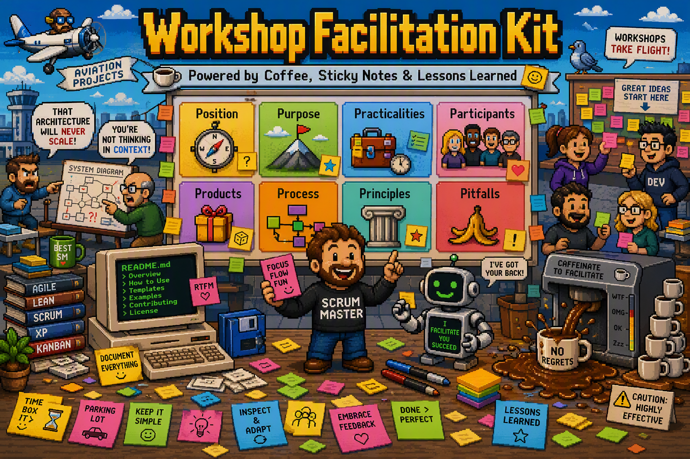

# Workshop Facilitation Kit

A reusable facilitation framework for designing and running workshops using AI assistance.




This repository contains:

- A Workshop Planning Framework (6+2P Canvas)
- Facilitation guidance
- Workshop templates
- AI instructions (`CLAUDE.md`)
- Example workshops

The framework was originally designed for:

- Post-Mortems
- Lessons Learned
- Architecture Workshops
- Collaboration Improvement Workshops

but can be adapted to any workshop type.

---

# Core Framework

The framework uses the 6+2P Workshop Planning Canvas:

1. Position (added)
2. Purpose
3. Practicalities
4. Participants
5. Products
6. Process
7. Principles
8. Pitfalls (added)

The canvas is used to design workshops before creating agendas and invitations.

---

# Typical Workflow

## Step 1 - Create a workshop folder

```text
workshops/
└── 2026-07-example-workshop/
```

## Step 2 - Gather source material

Create an inputs folder:

```text
workshops/2026-07-example-workshop/inputs/
├── emails.pdf
├── interviews.pdf
├── meeting-notes.docx
├── architecture-document.pdf
└── jira-export.xlsx
```

Add any material that provides context.

---

## Step 3 - Ask Claude to complete the canvas

Example prompt to run from `workshops/2026-07-example-workshop`:

```text
Using CLAUDE.md and all files in /inputs:

1. Identify the workshop type.
2. Complete the 8P Workshop Canvas.
3. Highlight missing information.
4. Challenge assumptions.
```

Expected output:

```text
canvas.md
```

---

## Step 4 - Generate the workshop agenda

Example prompt:

```text
Using the completed canvas:

Create a detailed workshop agenda.

For each activity provide:
- objective
- duration
- facilitation technique
- detailed facilitation instructions
- expected output
```

Expected output:

```text
agenda.md
```

---

## Step 5 - Generate the invitation

Example prompt:

```text
Using the completed canvas and agenda:

Generate a professional invitation email.

Include:
- purpose
- participant expectations
- preparation instructions
- outcomes
- workshop principles
```

Expected output:

```text
invitation.md
```

---

## Step 6 - Generate workshop deliverables

Depending on the workshop type.

### Post-Mortem

Prompt:

```text
Create a draft incident documentation.
```

Expected output:

```text
incident-document.md
```

Sections:

- Metadata
- Executive Summary
- Customer Impact
- Timeline
- Root Causes
- Contributing Factors
- What Went Well
- What Went Poorly
- Actions

### Collaboration Workshop

Prompt:

```text
Generate a working agreement draft.
```

Expected output:

```text
working-agreement.md
```

---

# Workshop Types

Supported workshop types:

- Post-Mortem
- Lessons Learned
- Collaboration Improvement
- Retrospective
- Architecture Review
- Decision Workshop
- Discovery Workshop
- Strategy Workshop

Claude should adapt the agenda and facilitation techniques according to the workshop type.

---

# Facilitation Principles

Always:

- Assume positive intent
- Focus on systems rather than people
- Challenge ideas, not individuals
- Encourage balanced participation
- Maximize learning
- Create actionable outcomes
- Increase psychological safety

---

# Example Prompt

```text
Read CLAUDE.md.

Analyze all files present in the inputs folder.

Then:

1. Identify the workshop type.
2. Fill the 8P Canvas.
3. Create a detailed agenda.
4. Generate the invitation.
5. Generate all workshop outputs.
```
